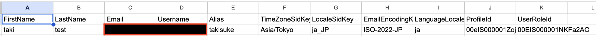

## 概要

-  Salesforce ユーザーをAPIで作成する用のスクリプト
- [Quita](https://qiita.com/Kyohei-takiyama/items/b2e3d5fcba4a15152c24)

## 事前準備

- Git Clone する
- .env.sampleファイルをコピーして`src/envs`配下に`.env.dev`(開発用)と`.env.prod`(本番用)を作成して配置する(.env.devと.env.prodを作成しないとコマンド実行時にエラーになる)
- 作成するユーザーのExcelファイルまたはスプレッドシートを用意しておく
  - example
  
- CSV形式でローカルにダウンロードする
- `src/files`配下に`ユーザー作成シート.csv`という名称で配置する(ファイルの置き場所やファイル名はソースコードを修正すれば適宜変更可能)


## 実行方法

- Makefileがあるので、トップディレクトリで下記コマンドを実行
```sh
# =========== 開発環境用
# 実行される内容
# 仮想環境の作成 -> ライブラリのインストール -> スクリプトの実行 -> 仮想環境の削除
make run

# =========== 本番環境用
# 実行される内容
# 仮想環境の作成 -> ライブラリのインストール -> スクリプトの実行 -> 仮想環境の削除
# 本番環境用の場合はスクリプト実行に一回確認のプロンプトが表示されます
make run-prod
```